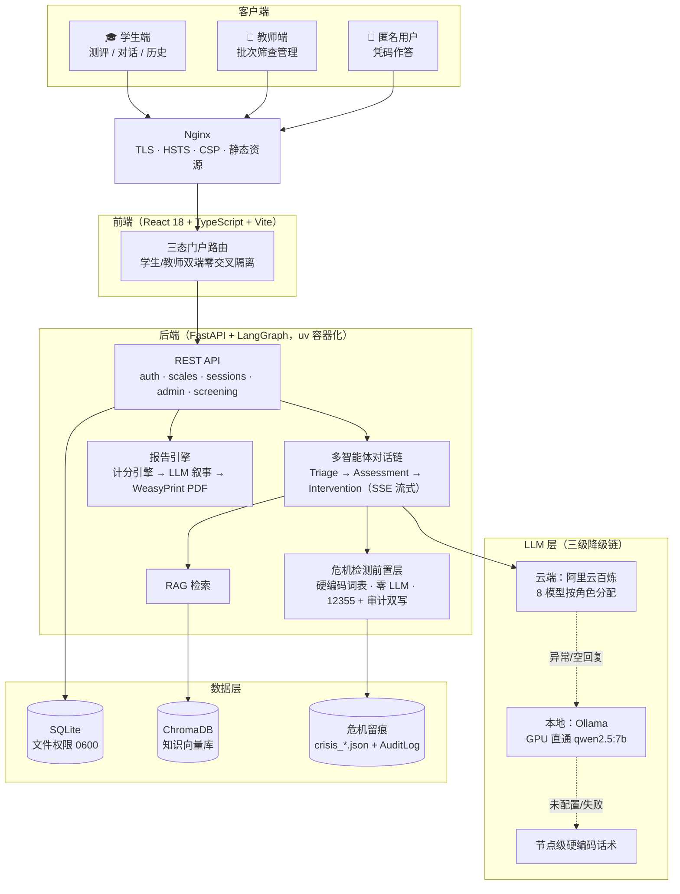
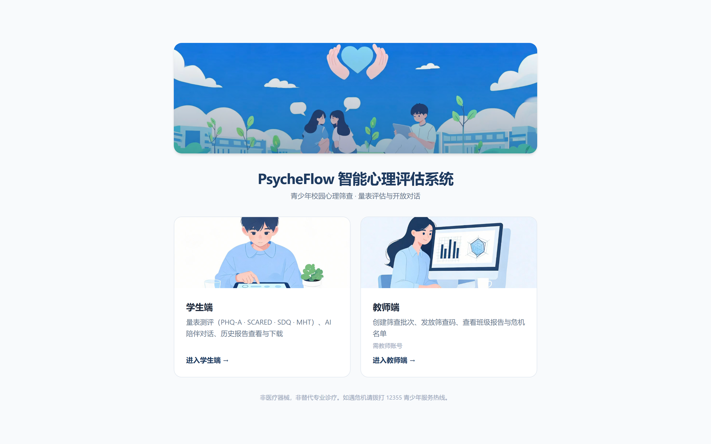
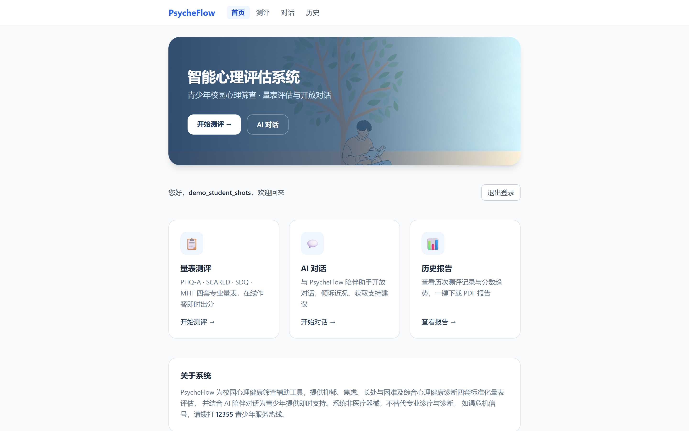
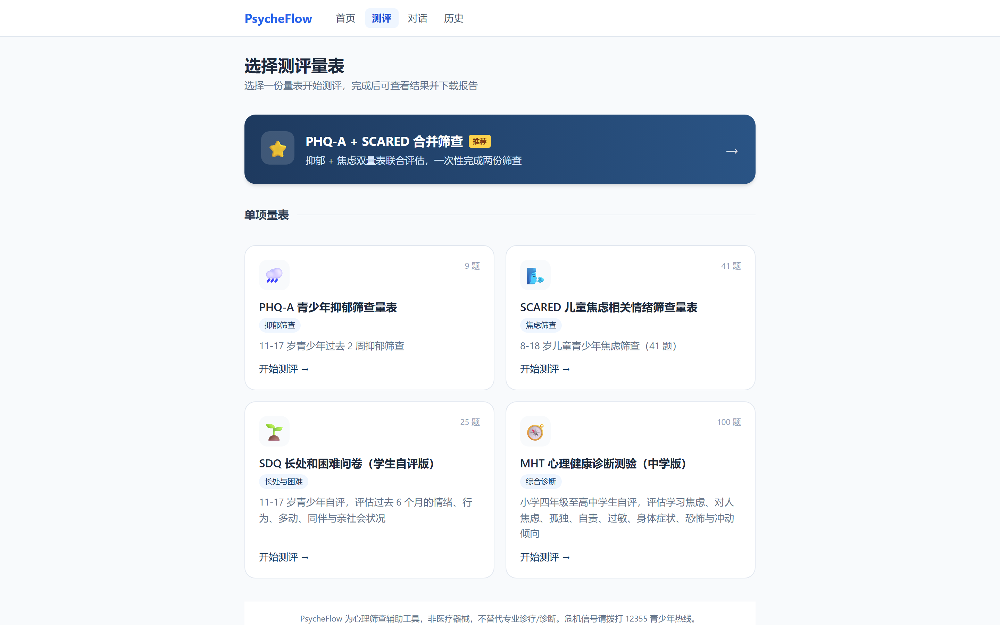
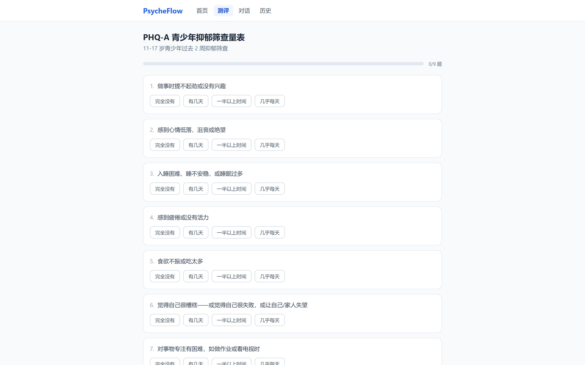
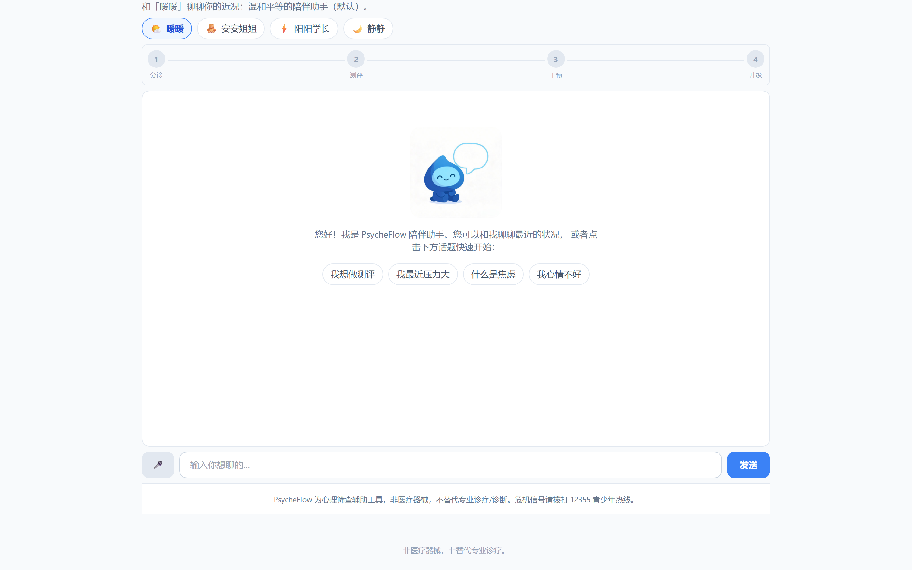
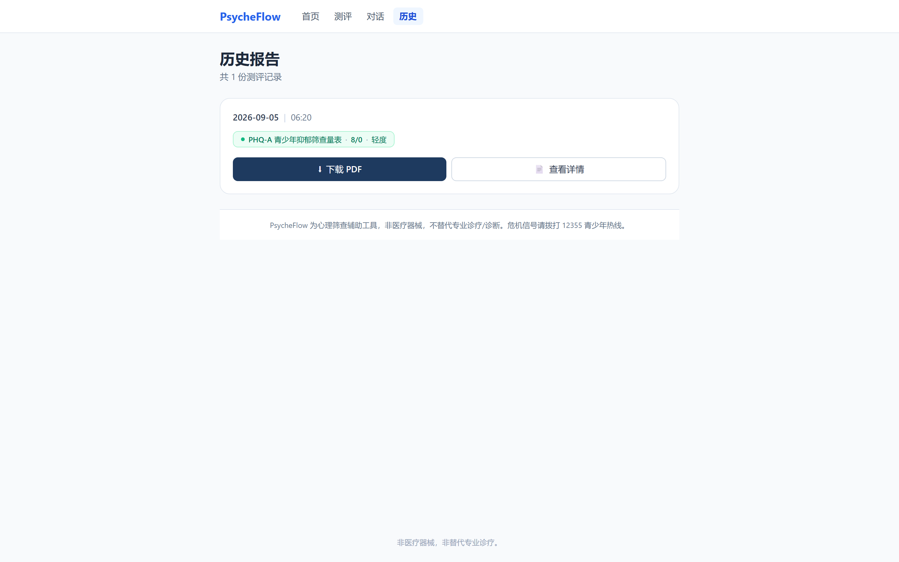
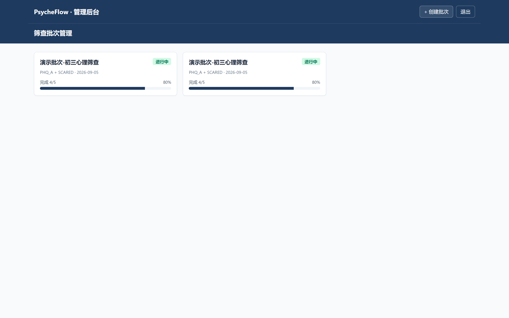
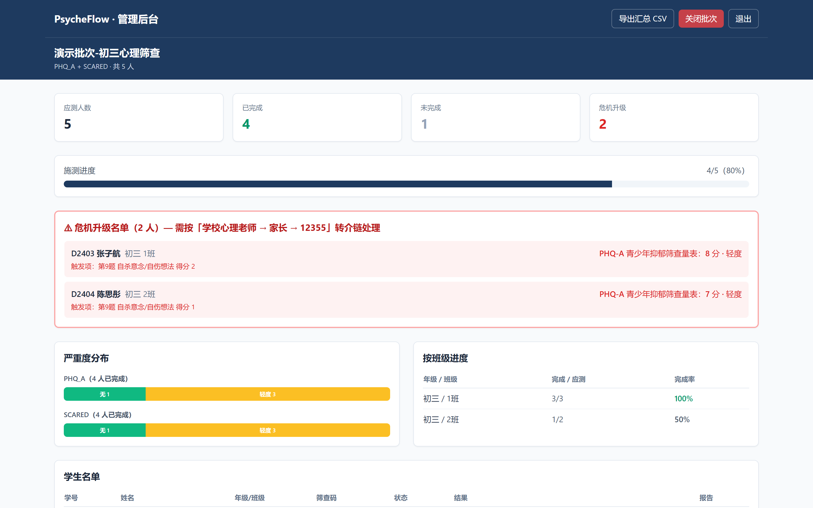

# PsycheFlow · 智能心理评估系统

[](https://github.com/Gunaie/PsycheFlow/actions/workflows/ci.yml)

利用大语言模型与多智能体技术，提供标准化心理测评、开放式 AI 对话、智能报告生成的一体化心理健康筛查服务。

> 定位：面向中小学生的校园心理筛查辅助工具。**非医疗器械，非替代专业诊疗。**

## 功能总览

- **标准化测评**：PHQ-A（抑郁）/ SCARED（焦虑，支持与 PHQ-A 合并双量表）/ SDQ / MHT 四套量表，规则化计分（SDQ 反向计分、PHQ-A 自杀意念单项直达升级），不进 LLM
- **智能报告**：单页长报告（对齐 MHT 六章节结构）、子维度雷达图（3+ 因子量表）、测评用时、发展建议（LLM 生成 + 兜底话术）、PDF 导出与下载
- **AI 对话**：LangGraph 四智能体编排（分诊→测评→干预→升级）、SSE 流式输出（寒暄毫秒级，对话首 token < 1.5s）、RAG 心理知识库引用卡片（高精度过滤）、4 种对话人格切换、语音输入（ASR）/ 朗读（TTS）
- **危机处理**：`detect_crisis` 前置于一切 LLM 调用、零 LLM 硬编码响应、12355 青少年热线、`crisis_*.json` 落盘 + 审计日志 DB 双写
- **批量筛查**：教师管理后台（认证登录、CSV 名单建批次、6 位筛查码、学生匿名作答、统计聚合与导出）
- **合规加固**：注册知情同意链、非 root 容器（prod uid 1000）、SQLite 文件 0600、备份 AES-256-CBC 加密（`scripts/backup_db.py`）
- **灾备兜底**：百炼云端异常/空回复时自动回退本地 Ollama（可选启用，详见 [DEPLOY.md](./DEPLOY.md)）

## 技术栈

- **前端**：React + Vite + TypeScript + TailwindCSS
- **后端**：Python + FastAPI + Pydantic + LangGraph + SQLAlchemy
- **数据库**：SQLite3（MVP）→ PostgreSQL（规模化）
- **向量库**：Chroma
- **模型**：阿里云百炼云端 API（intake=qwen3.8-2.4t-a95b / triage=qwen3.8-27b / dialog=deepseek-v4-pro-0813 / dialog_stream=qwen3.8-max / report=deepseek-v4-flash-0731 / embed=text-embedding-v3 / ASR+TTS=qwen-audio-3.0）+ Ollama 本地兜底（可选）
- **报告 PDF**：WeasyPrint + Jinja2
- **部署**：Docker Compose（chroma + backend + frontend；prod 叠加非 root + 4 worker + nginx TLS）

## 质量与性能指标

> 由 `backend/scripts/eval_triage.py` / `eval_report.py` / `perf_bench.py` / `e2e_acceptance.py` 实测产出，基线快照见 `backend/scripts/eval/results/`。

| 维度 | 指标 | 数值 |
|---|---|---|
| **LLM 输出评估** | Triage 意图分诊准确率（43 条标注样本，qwen3.8-27b） | **97.7%**（42/43） |
| | └ 危机类命中（硬编码词表，安全回归） | **100%**（8/8） |
| | 报告结构合规率（5 场景 × 15 项断言，deepseek-v4-flash） | **100%**（76/76） |
| **性能（NFR）** | SSE 对话首 token 延迟（0.5b 极速分诊优化后） | **寒暄 < 0.5s / 对话 ~1.2s** |
| | `/api/health` 50 并发 | QPS 361，P95 128ms |
| **测试** | 后端 pytest | 199 passed / 1 skipped |
| | 端到端验收（登录→对话→危机→报告→审计） | **7/7 PASS** |
| **CI** | GitHub Actions（pytest + 前端构建 + 镜像构建） |  |

## 系统架构



## 界面速览

| 门户 | 学生首页 |
|---|---|
|  |  |
| **量表选择** | **量表作答** |
|  |  |
| **AI 陪伴对话（极致简洁体验）** | **历史报告** |
|  |  |
| **教师端·批次列表** | **教师端·批次详情（危机名单 + 严重度分布）** |
|  |  |

> 截图由 [backend/scripts/screenshots.py](backend/scripts/screenshots.py) 一键生成（自动造演示数据：批次、测评记录、危机名单），可复现。

## 快速开始

### 1. 配置密钥
复制环境变量模板并填入百炼 API Key：
```bash
cp .env.example .env
# 编辑 .env，填入 DASHSCOPE_API_KEY
```

### 2. 一键启动（开发模式）
```bash
docker compose up -d --build
```
- 前端：http://localhost:5174（Vite dev server，`/api` 经 Vite 代理到后端，无跨域）
- 后端 API：http://localhost:8000（Swagger 文档 `/docs`）
- Chroma：http://localhost:8001

### 3. 构建 RAG 知识库（首次必须）
```bash
curl -X POST http://localhost:8000/api/rag/build
```

完整部署（生产模式 / TLS / Ollama 兜底 / 验收与运维）见 [DEPLOY.md](./DEPLOY.md)。

## 项目结构

```
PsycheFlow/
├── frontend/              # React 前端（pages/ 含 admin/ 管理后台三页）
├── backend/
│   ├── app/               # FastAPI（api/ agents/ rag/ reports/ scales/ core/）
│   ├── scripts/           # 诊断/验收脚本（e2e_acceptance.py、backup_db.py 等）
│   └── tests/             # 单元测试（pytest）
├── data/                  # 运行期产物：SQLite + Chroma + 量表/知识库 + backups/
├── logs/                  # 审计日志
├── certs/                 # 生产 TLS 证书
├── scripts/               # （空，保留）
├── docker-compose.yml     # 开发环境
├── docker-compose.prod.yml# 生产 override（非 root + 4 worker + nginx TLS）
├── .env.example           # 环境变量模板（模型/安全/Ollama 兜底）
├── DEPLOY.md              # 部署指南
├── HANDOVER.md            # 项目交接文档（架构/已知坑/验证清单）
└── 开发计划.md            # 完整开发计划与方案
```

## 相关文档

- [DEPLOY.md](./DEPLOY.md)：新机器从零部署（开发/生产/TLS/Ollama/验收/运维）
- [HANDOVER.md](./HANDOVER.md)：交接文档（模块索引、已知坑清单、验证 Checklist）
- [开发计划.md](./开发计划.md)：完整开发计划与方案
- [docs/监护人知情同意书模板.md](./docs/监护人知情同意书模板.md)：试点合规材料（与系统四项同意逐条对应）
- [docs/教师操作手册.md](./docs/教师操作手册.md)：建批次/看报告/危机处置 SOP
