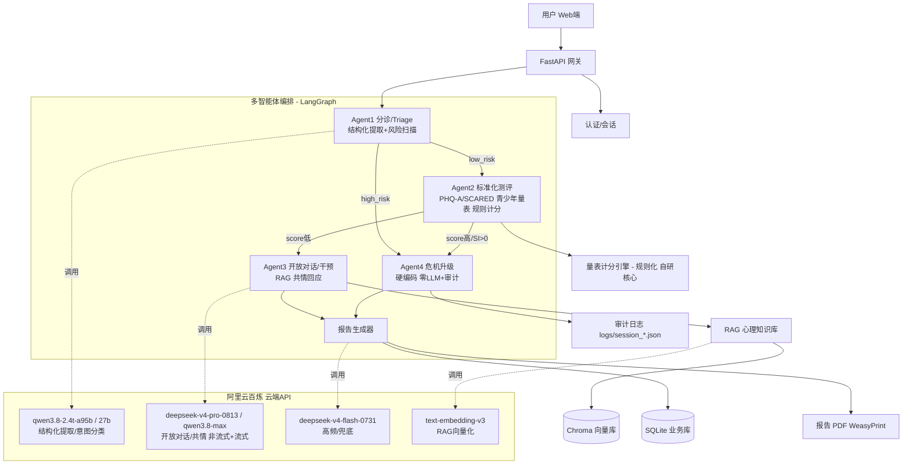

# PsycheFlow · 智能心理评估系统 · 开发计划

> 本文档整合前期调研与方案确认结论，作为开发执行依据。确认后即进入编码阶段。
> 调研日期：2026-08-31 ｜ 状态：**已实施完成**（MVP 一期 ~ 五期优化全部落地，截至 2026-09-06；实施细节与当前进度见 [HANDOVER.md](./HANDOVER.md)）

---

## 一、项目概述

**项目名称**：PsycheFlow（智能心理评估系统）

**定位**：利用大语言模型与多智能体技术，提供标准化心理测评、开放式 AI 对话、智能报告生成的一体化心理健康筛查服务。

**核心价值**：把"标准化量表施测 + 开放对话 + 智能报告"串成一体化筛查流水线，降低首层筛查门槛，扩大覆盖面，保留人工复核环节。**定位为筛查辅助工具，非医疗器械，非替代专业诊疗。**

**最终目标用户：中小学生**（MVP 直接面向，校园心理筛查场景）

**配套角色**
- B 端：中小学校心理中心/德育处、教育局心理普测、EAP 服务商
- 专业人员：学校心理老师、校外心理咨询师（辅助初筛 + 会话留档 + 转介接收）

> **目标用户决策说明**：最终目标即中小学生，MVP 直接做青少年版（不再先用成人版验证）——①量表用青少年适配版 **PHQ-A**（抑郁）+ **SCARED**（焦虑），SDQ 二期扩展；②合规从 MVP 起做：注册需监护人/学校授权，14周岁以下儿童信息受《个保法》特别保护；③报告接收方为学校心理老师 + 家长；④危机升级转介链：学校心理老师 → 家长 → 12355 共青团青少年热线；⑤"答题测验"即通过量表施测答题判断心理状况，是核心功能本身，非独立新模块。

---

## 二、已确认决策摘要

| 项 | 决策 |
|---|---|
| 开发路线 | **完全自研**（融合借鉴开源项目设计，不基于单一项目二次开发） |
| 前端 | **React + Vite + TypeScript + TailwindCSS** |
| 后端 | **Python + FastAPI + Pydantic** |
| 数据库 | **SQLite3**（MVP）→ PostgreSQL（规模化） |
| 向量库 | **Chroma**（Docker 部署 + 数据卷持久化） |
| Agent 编排 | **LangGraph + LangChain**（状态图 + 条件路由，参照 mental-health-multi-agent-pipeline 范式） |
| 报告 PDF | **WeasyPrint + Jinja2**（后端生成） |
| 包管理 | 后端用 **uv**（符合个人习惯） |
| 模型平台 | **全阿里云百炼**（云端 API，不本地部署模型）+ Ollama 本地兜底（五期，可选） |
| 模型配置 | qwen3.8-2.4t-a95b / qwen3.8-27b / deepseek-v4-pro-0813 / qwen3.8-max / deepseek-v4-flash-0731 / text-embedding-v3 / qwen-audio-3.0-asr-flash / qwen-audio-3.0-tts-flash（详见 §五，以 `.env.example` 为准） |
| 数据策略 | **MVP 不微调**（API + RAG + 公开量表）；二期用 SoulChatCorpus 微调 |
| 部署 | 百炼全云端 + Chroma/后端/前端 Docker 化 + SQLite 后端容器 volume 挂载 .db |

---

## 三、业务需求（精简 PRD）

### 3.1 解决的问题
传统心理筛查"量表人工施测 + 报告人工撰写"成本高、覆盖窄、主观性强；纯聊天机器人缺乏标准化、无报告产出。本系统用 LLM + 多智能体把标准化测评 + 开放对话 + 智能报告串成一体化流水线。

### 3.2 核心功能（按优先级）

| 优先级 | 功能 |
|---|---|
| P0 | 学生账号注册（监护人/学校授权）、PHQ-A+SCARED 青少年量表施测与自动计分（通过答题判断心理状况）、开放式 AI 对话（青少年风格）、基础评估报告生成、危机关键词拦截 |
| P1 | 多智能体编排（分诊→测评→干预→升级）、RAG 心理知识库、报告 PDF 导出（家长/心理老师接收）、历史报告管理、风险升级转介（学校心理老师/12355） |
| P2 | 语音输入、多角色人格切换、B 端校方管理后台、量表库扩展（SDQ/MSSMHS）、多模型适配 |

### 3.3 非功能性需求

| 维度 | 要求 |
|---|---|
| 安全 | 危机升级走硬编码、不走 LLM；学生敏感数据加密存储；符合《个人信息保护法》《未成年人保护法》，14周岁以下儿童信息特别保护 |
| 性能 | 对话首 token < 2s；单份量表报告生成 < 10s；并发 50 会话 |
| 扩展性 | 量表库/模型/Agent 可插拔；多 LLM Provider 适配 |
| 可靠性 | 量表计分确定性强（低温度、规则化）；对话留痕可审计 |
| 合规 | 全程"非医疗器械、非替代专业诊疗"免责声明 |

---

## 四、技术架构



**架构说明**
- 量表计分是自研规则化引擎，**不进 LLM**，确保确定性
- 危机升级 Agent 硬编码，**零 LLM 调用**，前置关键词扫描 + 审计日志
- 4 个百炼模型各司其职，通过 Provider 抽象层统一调用
- PHQ-A 自杀意念相关条目单项 > 0 即直达升级，不看总分；转介学校心理老师/家长/12355

---

## 五、模型配置（全百炼云端 + Ollama 兜底）

> ⚠️ 下表为**当前实际生效配置**（与 [.env.example](.env.example) 同步，2026-09-05）；规划期的 4 模型配置（qwen3.7-plus 等）已按额度与延迟实测多次替换演进，演进过程见 [HANDOVER.md](./HANDOVER.md) §5。

| 用途（role） | 模型 | 角色定位 | 备注 |
|---|---|---|---|
| intake | `qwen3.8-2.4t-a95b` | 结构化提取/计分辅助 | 有思考链；不支持关思考（enable_thinking 强制 True） |
| triage | `qwen3.8-27b` | 意图分类（4 类标签） | 关思考链，首 token 0.38s，max_tokens=50 |
| dialog | `deepseek-v4-pro-0813` | 非流式共情对话 | 有思考链，max_tokens=3000 |
| dialog_stream | `qwen3.8-max` | SSE 流式共情对话 | 关思考链，首 token 0.58s |
| report | `deepseek-v4-flash-0731` | 报告生成（发展建议等） | 有思考链，max_tokens=4000 |
| embed | `text-embedding-v3` | RAG 知识库切片向量化 | 中文 embedding |
| ASR | `qwen-audio-3.0-asr-flash` | 语音识别 | DashScope 原生 multimodal-generation HTTP |
| TTS | `qwen-audio-3.0-tts-flash` | 语音合成 | DashScope 原生 audio/tts HTTP（不用 SDK WebSocket） |
| 本地兜底 | Ollama `qwen2.5:7b`（可配） | cloud 异常/空回复时回退 | 可选启用，整机共享独立容器（见 DEPLOY.md） |

**Provider 抽象层**：统一百炼 OpenAI 兼容协议，`.env` 配置 `DASHSCOPE_API_KEY` + 各 role 模型名（`MODEL_INTAKE`/`MODEL_TRIAGE`/`MODEL_DIALOG`/`MODEL_DIALOG_STREAM`/`MODEL_REPORT`/`MODEL_EMBED`/`MODEL_ASR`/`MODEL_TTS`），便于切换/扩容其他平台；[core/llm.py](backend/app/core/llm.py) 按 role 路由并实现 Ollama 兜底链（cloud → Ollama → 节点级硬编码话术）。

---

## 六、部署分工

| 组件 | 开发期 | 生产期 | 说明 |
|---|---|---|---|
| 百炼 LLM/Embedding | 云端 | 云端 | 不部署，HTTPS 调用 |
| 前端 React | 本地 npm run dev | Docker（nginx 托管） | 开发期 Vite HMR |
| 后端 FastAPI | **Docker**（规避 WeasyPrint Windows 系统库坑） | Docker | 挂载代码 + 热重载 |
| Chroma 向量库 | Docker | Docker | 数据卷持久化索引 |
| SQLite | 后端容器 volume 挂载 .db | 后端容器 volume 挂载 .db | 文件库无需独立容器，挂载到宿主机 `./data/` 持久化，备份即复制 .db |
| WeasyPrint (PDF) | Docker | Docker | 依赖 cairo/pango，Linux 镜像 apt 装系统库 |

**docker-compose 服务清单（生产/集成）**

| 服务 | 镜像/构建 | 职责 |
|---|---|---|
| `chroma` | 官方 chromadb/chroma | 向量存储，挂载 `./data/chroma` |
| `backend` | 本地 Dockerfile（Python + uv + WeasyPrint 系统库） | FastAPI + LangGraph + RAG + PDF，挂载代码 + `.env` + `./data/psycheflow.db`（SQLite volume） |
| `frontend` | 本地 Dockerfile（Node 构建 → nginx） | 托管 React 产物，反代 `/api` 到 backend |

**关键决策理由**：你是 Windows 11，WeasyPrint 在 Windows 本地装要配 GTK runtime + cairo/pango，坑非常多 → 后端放进 Linux Docker 一步到位。开发期后端也用 Docker + volume 挂载代码 + `--reload`。

---

## 七、数据策略

### 7.1 量表题库（青少年适配，公开标准化，无版权）
- **PHQ-A**（PHQ-9 青少年版，11-17岁抑郁筛查）、**SCARED**（儿童焦虑相关情绪筛查，8-18岁）：公开免费，国际学校普测常用
- 二期扩展：**SDQ**（长处与困难问卷，WHO 推荐，4-17岁，有中文版）、**MSSMHS**（中国中学生心理健康量表，王极盛编制）
- ⚠️ MBTI 有商标问题 → 人格评估用 **Big Five / IPIP** 免费版本替代
- 落地为 `scales/` 目录结构化题项 + 计分规则（自研核心）

### 7.2 RAG 心理知识库语料（MVP 必需）
- CCMD-3《中国精神障碍分类与诊断标准》
- DSM-5 公开摘要、WHO 心理健康指南
- 国家卫健委《心理援助热线技术指南》
- CBT/DBT 技术手册公开版
- 切片入库（百炼 text-embedding-v3 向量化 → Chroma），标注来源可溯源

### 7.3 心理对话数据集（二期微调用，MVP 不需要）
- ⚠️ 注意：SoulChatCorpus/EmoLLM 等开源数据**均为成人场景**，青少年对话数据稀缺（汇总库 github.com/Kevin11Kaikai/Awesome-Open-Mental-Health-Dialogue-Datasets 中仅 DeepWell-Adol 为青少年主数据集）
- MVP 不微调，靠百炼 API + 青少年风格 prompt + RAG 兜底对话质量
- 二期微调策略：SoulChatCorpus（成人共情基础）+ DeepWell-Adol（青少年场景对齐）混合微调
- 汇总索引：github.com/Kevin11Kaikai/Awesome-Open-Mental-Health-Dialogue-Datasets

### 7.4 数据合规（青少年特别保护）
- 学生（未成年人）注册需监护人/学校授权同意链
- 14周岁以下学生信息受《个保法》特别保护，最小化收集、加密存储
- 真实学生对话脱敏存储，不用未授权患者数据
- 危机升级时通知学校心理老师/家长（自杀风险下打破隐私保护优先生命）
- 心理援助热线语料需获授权

---

## 八、项目目录结构（实际落地，2026-09-05 同步）

```
PsycheFlow/
├── frontend/                     # React + Vite + TypeScript + TailwindCSS
│   ├── src/
│   │   ├── pages/                # Home/Chat/ScaleSelect/Scale/History/Login/Register/Screening
│   │   │   └── admin/            # 管理后台三页（登录/批次列表/批次详情）
│   │   ├── components/           # CrisisBanner / FooterDisclaimer 等
│   │   ├── lib/recorder.ts       # 浏览器 WAV 录音器（16kHz PCM）
│   │   ├── api.ts                # fetch 封装（含 SSE streamChat / apiGetBlob）
│   │   └── App.tsx               # 路由（学生端 + /admin 教师端）
│   └── Dockerfile                # dev（Vite HMR）/ prod（nginx:alpine + TLS）双 target
├── backend/
│   ├── app/
│   │   ├── main.py               # FastAPI 入口 + CORS + RAG 自动 ingest
│   │   ├── api/                  # auth/chat/sessions/scales/admin/screening/personas/voice/rag/llm
│   │   ├── agents/               # graph.py 四智能体 StateGraph + nodes/ + personas + prompts
│   │   ├── core/                 # config / llm(Provider+Ollama兜底) / safety / audit / voice
│   │   ├── rag/                  # 知识库构建+检索（Chroma）
│   │   ├── reports/              # 单页报告模板 + 生成器（WeasyPrint，MHT 六章节风格）
│   │   ├── scales/               # 量表库: phq_a/scared/sdq/mht 计分规则(自研核心)
│   │   ├── db.py / models.py     # SQLAlchemy（Session/AssessmentRecord/User/Batch/AuditLog…）
│   ├── scripts/                  # e2e_acceptance / backup_db / perf_bench / sse_first_token 等诊断脚本
│   ├── tests/                    # pytest 单测（计分/审计/流式/兜底/合规等 ~200 例）
│   ├── pyproject.toml            # uv 管理
│   └── Dockerfile                # Python + uv + WeasyPrint 系统库 + appuser(uid 1000)
├── data/                         # 运行期产物（bind mount）
│   ├── chroma/                   # 向量库持久化
│   ├── knowledge/                # RAG 心理学知识源文档
│   ├── scales/                   # 量表题库数据
│   ├── backups/                  # 加密备份 *.db.enc
│   └── psycheflow.db             # SQLite 数据库（0600）
├── logs/                         # 审计日志（session_*.json / crisis_*.json）
├── certs/                        # 生产 TLS 证书
├── docker-compose.yml            # 开发：chroma + backend(--reload) + frontend(Vite HMR)
├── docker-compose.prod.yml       # 生产 override：非 root + 4 worker + nginx TLS + healthcheck
├── .env.example                  # 百炼 Key + 8 模型 + 安全合规 + Ollama 兜底模板
├── README.md / DEPLOY.md / HANDOVER.md / 开发计划.md
```

---

## 九、开发流程与迭代计划

### 9.1 一期 · MVP（本次执行重点）✅ 已完成

**目标**：跑通"测评 + 对话 + 报告 + 危机拦截"主链路，可演示闭环。

**落地步骤（按顺序）**

| 步骤 | 内容 | 产出 |
|---|---|---|
| 1 | 项目骨架 + docker-compose + 后端 Dockerfile（含 WeasyPrint 系统库）+ 前端脚手架 | 可起的空项目 |
| 2 | 量表计分引擎（PHQ-A/SCARED 青少年版 自研核心 + 单元测试） | 确定性计分，边界分/反向计分/单项升级 |
| 3 | 百炼 Provider 抽象层（4 模型配置化 + OpenAI 兼容调用） | 可调用 4 个百炼模型 |
| 4 | RAG 知识库 + Chroma 接入（text-embedding-v3 向量化） | 心理学知识可检索 |
| 5 | FastAPI 接口（auth/assessment/chat/report）+ React 前端页面 | 可登录、答题、对话、看报告 |
| 6 | 报告 PDF 生成（Jinja2 模板 + WeasyPrint）+ 危机关键词拦截 + 审计日志 | 可导出 PDF、安全兜底 |

**MVP 验收标准**
- 用户可注册登录
- 完成 PHQ-A/SCARED 施测，自动计分并显示等级（通过答题判断心理状况）
- 可进行开放式 AI 对话（带上下文记忆 + RAG 共情）
- 生成简版报告（量表分 + 对话摘要 + 风险等级 + 建议）并导出 PDF
- 危机关键词触发硬编码升级响应 + 审计日志
- 历史报告列表可查看

### 9.2 二期 · 多智能体 + 微调 ✅ 智能体编排已完成（微调未做，按决策 MVP 不微调）
- 引入 LangGraph 四智能体编排（分诊→测评→干预→升级全链路）
- 用 SoulChatCorpus 微调对话模型（可选，视效果）
- 完善 RAG 知识库（CBT/DBT 全量语料）

### 9.3 三期 · 报告与后台
- 完善 PDF 报告模板（维度雷达图/柱状图）
- B 端管理后台、批量筛查、历史报告管理
- 多租户支持

### 9.4 四期 · 扩展
- 量表库扩展（SDQ、MSSMHS、Big Five 人格）
- 多角色人格切换（参照 EmoLLM 范式，适配青少年）
- 语音输入（百炼 qwen-audio ASR）

### 9.5 五期 · 优化 ✅ 大部分完成（性能压测/合规加固/Ollama 兜底/生产验收已落地；多 Provider 推后，多租户待做）
- 并发性能优化、合规审计加固
- 本地小模型兜底（Ollama，断网/降本场景）
- 多 Provider 切换（硅基流动等）

---

## 十、开发风险与应对

| 风险 | 应对 |
|---|---|
| LLM 幻觉影响测评准确性 | 量表计分纯规则化、不进 LLM；对话仅做语义辅助与共情 |
| 危机响应被 LLM 接管 | 硬编码升级 Agent，关键词前置扫描，零 LLM 调用 |
| WeasyPrint Windows 装机地狱 | 后端整体 Docker 化（Linux 镜像 apt 装系统库） |
| 百炼 API 速率/成本限制 | Provider 抽象层支持切换；响应缓存；flash 模型兜底 |
| 中文心理知识库匮乏 | RAG 语料从公开心理学教材/指南切片入库，标注来源 |
| 量表计分确定性 | 单元测试覆盖反向计分/边界分/单项升级规则 |
| 未成年人合规风险 | 监护人授权链；14周岁以下儿童信息特别保护；危机时通知学校心理老师/家长；全程免责声明，不对外宣称诊疗能力 |
| 数据隐私 | 真实用户对话脱敏存储；API Key 不进 Git |

---

## 十一、安全设计原则（贯穿全程）

| 原则 | 实现 |
|---|---|
| 危机响应非自主 | 危机 Agent 永不调用 LLM，响应静态预审 |
| LLM 前置安全扫描 | 关键词扫描在 Agent1/Agent2 任何 LLM 调用前执行 |
| 审计留痕 | 每次危机升级记 `logs/session_{id}.json`，含时间戳与触发词 |
| 保守计分 | 测评温度 0.1、干预 0.35，不确定性优先降级 |
| PHQ-A 自杀意念监控 | 自杀意念相关条目单项 > 0 直达升级，不看总分 |
| 青少年转介链 | 升级即通知学校心理老师 → 家长 → 12355 共青团青少年热线，全程审计 |
| 量表计分与 LLM 隔离 | 计分纯规则化，LLM 仅辅助对话语义 |

---

## 十二、借鉴的开源项目（参考范式，不依赖代码）

| 项目 | 借鉴点 | 链接 |
|---|---|---|
| SmartFlowAI/EmoLLM | RAG 模块范式、多角色 prompt 模板、心理健康模型权重（二期可选） | github.com/SmartFlowAI/EmoLLM |
| opendilab/PsyDI | 评分表 + 迭代精修评估框架、Next.js 全栈结构 | github.com/opendilab/PsyDI |
| EshaRana17/mental-health-multi-agent-pipeline | LangGraph 四智能体拓扑、TypedDict 共享状态、危机硬编码升级、审计日志 | github.com/EshaRana17/mental-health-multi-agent-pipeline |
| scutcyr/SoulChat | 二期微调数据 SoulChatCorpus | github.com/scutcyr/SoulChat |

---

## 十三、执行确认

以上为完整开发计划。**确认后执行顺序**：

1. 项目骨架 + docker-compose + 后端 Dockerfile（WeasyPrint 系统库）
2. 量表计分引擎（PHQ-A/SCARED 青少年版 自研核心 + 单测）
3. 百炼 Provider 抽象层（4 模型配置化）
4. RAG 知识库 + Chroma 接入
5. FastAPI 接口 + React 前端
6. 报告 PDF 生成 + 危机拦截兜底

**回复"确认"或"OK"后即开始执行步骤 1。**
